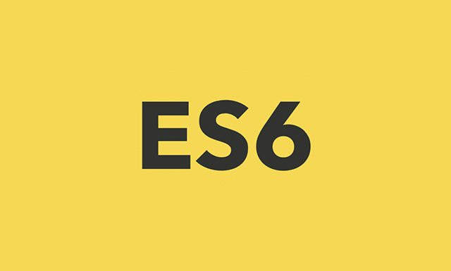

# ES6

***

## Overview

*Just documenting my JavaScript journey.*

***
## Features

This project includes:
- [x] ES6
- [x] Vanilla JS
- [x] Object 
- [x] Variables 
- [x] Scope
- [x] Math Operators 
- [x] Logical Operators 
- [x] Conditional Operators 
- [x] Arrays
- [x] Loops
- [x] Functions 
- [x] Higher Order Functions 
- [x] Template Literals

***

### [ES6](https://github.com/lordson-silver/ES6)

***

## Running the project locally 

1. Clone the repo locally 
2. Open the index file on any Web browser (chrome preferably)

***

## Want to contribute? 

_Feel free to._

